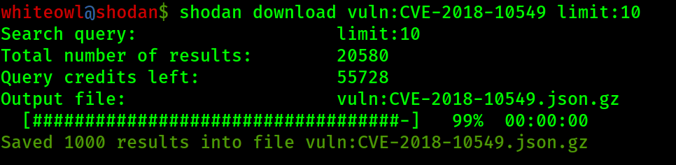

## Shodan Cheat Sheet

```
--------------------------------- < Shodan Search> -----------------------------------


----------------- < popular fields > -------  ------------------------- < boolians > -----------------------
|        ip_str   :show ips                |  |        has_screenshot:true   :devices that has screenshots |
|        port     :show ports              |  |        has_ssl:true          :devices that has ssl         |
|        org      :show organization       |  |        has_vuln:true         :devices that has vuln        |
|        country  :show country            |   -------------------------------------------------------------
--------------------------------------------
Complete Filters and Fields: https://www.shodan.io/dashboard #after signing up!

#use - to exclude filters 
# Examples
has_screenshot:true -port:3389
cam -country:us


--------------------------------- < Shodan CLI Search > ----------------------------------
shodan init <api-key>   #Initialize Shodan command-line


------- < CLI search > ----------
==> shodan search <options> <search query>
#better to use download flage and parse than search in CLI

shodan search <query>  #search for the given word
                       #Example: shodan search nginx

shodan search --fields <properties> --separator <separator> <query>

search with options (more: shodan search -h)

#Example: shodan search --fields ip_str,port --separator , nginx
#Example: shodan search port:80 country:fr apache
#Example: shodan search --fields ip,port,org port:80 country:fr apache limit: 10


--------- < Download&Parse > ----------
==> shodan download <options> <filename> <search query>

shodan download --limit <number> <filename> <query> #download result to file

#Example: shodan download --limit 200 results nginx
#Example: shodan download hacked-sites http.title:"Hacked by"
#Example: shodan download --limit 500 results city:amsterdam intel


==> shodan parse <options> <filename>
# more info: shodan parse -h (parse downloaded results)

shodan parse <filename>   #show all data
#Examples: shodan parse sho_1.json.gz

shodan parse --fields <field-options> --separator <seperator> <filename>

#show data fields
shodan parse --fields ip_str,port,org --separator, shodan-result.json.gz

shodan parse -f <propertyname:value> data.json.gz #show the filtered data
#Example: shodan parse -f port:443 -f product:Apache data.json.gz

--------< tests >----------
shodan host <ip-address> #show info (Vulnerabilities,City,Organization,open ports & ...) of specific IP-address
                         #use this tool for checking your home/comany public ip address.

shodan honeyscore <ip-address> #Check whether the target IP is a honeypot or not.
                               #45.56.92.229 is honeypot
----------------- < for using shodan Small Business&Corporate API Key > -----------------
==> shodan search vuln:<CVE ID> <options>

#Example: shodan search vuln:CVE-2018-10549 limit:10 
#show the 10 vuln Devices for the specific CVE

----------------- stats -----------------
#Provide summary information about a search query
==> shodan stats <options> <search query>
#search query protocols like: http,smb,ssh,ftp,arp,pop3,imap,rdp,vnc,smtp,snmp,..

<options>
--facets ==> port/city/org/country/isp/asn/ip ...   #many general filter can apply here

shodan stats --facets port ssh #query is ssh / facets top 10 port number using ssh
shodan stats --facets city:50 ssh country:FR #top 50 citys in France usgin ssh protocol
shodan stats --facets port:100,org:20 ssh #facets top 100 port and top 20 organization using ssh protocol

advance:
shodan stats --facets org country:FR ssl.version:sslv2 HTTP #top organization in france using ssl version 2
shodan stats --facets ssl.version country:US has_ssl:true HTTP #top of ssl version usage in USA
shodan stats --facets ip,port,ssl.version country:kz has_ssl:true http #shows the ip,port,version of ssl in tops for Kazakhstan
shodan stats --facets ip,ssl.version country:ir has_ssl:true port:443 http #shows the top ssl version of port 443 

shodan stats port:443 #summary of port 443 in top countires & organizations

----------------- < shodan links > -------------
https://www.shodan.io/about/products #all menus
https://exposure.shodan.io/#/      #Internet Exposure Observatory (shows unpatched vulunabalities in countries)
https://www.shodan.io/search/facet?query   #Facet Analysis (stats)
https://exploits.shodan.io 
https://www.shodan.io/explore/popular #popular search queries

----------------- < more examples > --------------------
site search examples:
os:xp smb
traffic signals
webcams
webcamXP
port:3389 #rdp (remote desktop protocol)
netgear
cisco
apache 2.4.50
Megapixel_IP_Camera

ftp anon
telnet authorized

cam has_ssl:true has_screenshot:true
cam has_screenshot:true
port:445 country:fr disabled #Authentication: disabled
cam authentication    # disabled Authentication
smb authentication    ## disabled Authentication
Foscam #ipcam manager
------------------- tips ----------------------------------
in shodan web search:
==> There is no space between the colon “:” and the value.
==> To use a value that contains a space with a filter you have to wrap the value in double quotes. #Ex: city:"San Diego"
==> A few filters let you specify several values that are separated by a comma.   #Ex: port:23,1023
==> Filters can also be used to exclude results by prepending a minus sign “-“ #-city:"San Diego"
```